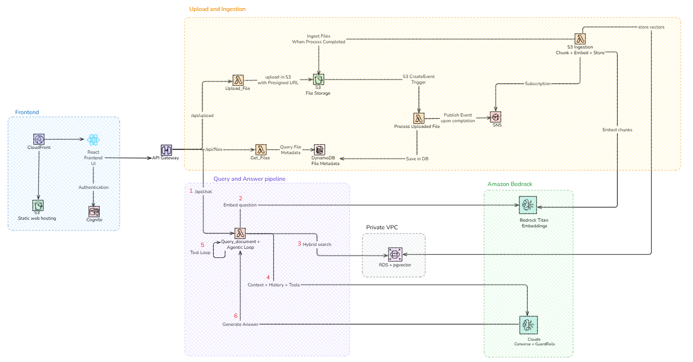

# AI Powered Document Chat App


A cloud-native application that allows users to chat with their documents using AI. Built with AWS Bedrock, RDS PostgreSQL + pgvector, and React. Uses **Retrieval-Augmented Generation (RAG)** to answer questions grounded in the user's own documents.

## Table of Contents

- [What is RAG?](#what-is-rag)
- [Features](#features)
- [Architecture](#architecture)
- [How It Works](#how-it-works)
- [Repository Structure](#repository-structure)
- [API Endpoints](#api-endpoints)
- [Security](#security)
- [Why these choices?](#why-these-choices)
- [Chunking and Search Considerations](#chunking-and-search-considerations)
- [Monitoring](#monitoring)
- [Production Readiness TODOs](#production-readiness-todos)
- [Scalability Limits](#scalability-limits)

## What is RAG?

**Retrieval-Augmented Generation (RAG)** is a technique that combines a vector search engine with a large language model (LLM). Instead of relying solely on the LLM's pre-trained knowledge, RAG first retrieves relevant passages from a document store and feeds them as context to the LLM before generating an answer.

**Pros:**
- Answers are grounded in your actual documents, reducing hallucination
- Works with private or domain-specific content the LLM was never trained on
- Easy to update the knowledge base without retraining the model
- Source citations are traceable

**Cons:**
- Answer quality depends heavily on chunking and retrieval quality
- Adds latency (embedding + vector search before LLM call)
- Irrelevant chunks can mislead the LLM if retrieval is poor
- Requires maintaining a vector database alongside the document store

### How RAG works in this project

1. **Ingestion** 

   When a document is uploaded to S3, the `s3-ingestion` Lambda extracts the text, applies a format-specific chunking strategy (see [Chunking and Search Considerations](#chunking-and-search-considerations)), and calls the configured Bedrock embedding model to convert each chunk into a vector. The vectors are stored alongside the text in RDS PostgreSQL using the `pgvector` extension.

2. **Query**

   When a user asks a question, the `query-document` Lambda embeds the question with the same Titan model, then runs a cosine similarity search (`<=>` operator) against the `document_chunks` table in PostgreSQL to find the most relevant chunks. Results can be scoped to a specific document or to all documents belonging to the user.

3. **Generation**

   The top matching chunks are assembled into a context prompt and sent to Anthropic Claude 4 on AWS Bedrock. Claude answers the question using only the retrieved context, then the response is returned to the frontend with source citations.

## Features

- **Document Upload**: Tested with PDFs, text files, Markdown. Supports multimodal embedding models (e.g. Amazon Titan Multimodal Embeddings)
- **AI-Powered Chat**: Ask questions about your documents using natural language
- **Semantic Search**: Vector similarity search with Amazon Titan embeddings (for text) and pgvector
- **LLM Integration**: Use any LLM available on AWS Bedrock. This project was tested with Anthropic Claude 4.6 Sonnet
- **Secure Authentication**: AWS Cognito with Google OAuth
- **Real-time Interface**: Modern React UI with Material-UI
- **Serverless Architecture**: Auto-scaling, pay-per-use infrastructure
- **Infrastructure as Code**: Complete Terraform deployment

## Architecture



**Frontend:**
- React (Vite) app with TypeScript
- Material-UI components
- Hosted on S3 + CloudFront

 

**Backend:**
- **API Gateway**: RESTful endpoints with JWT authentication
- **Lambda Functions**:
  - `upload` - Generate presigned S3 URLs
  - `get-files` - Query DynamoDB for user documents
  - `query-document` - RAG chat handler with Bedrock integration
  - `s3-ingestion` - Extract text, create embeddings, index to pgvector
    
    Applies a format-specific chunking strategy, converts each chunk into a vector using the configured Bedrock embedding model, then stores both the raw text and its vector in PostgreSQL (pgvector). Supported formats: `.pdf`, `.txt`, `.md`, `.docx`.

    Each row in `document_chunks` is:

    | column        | what it stores                                              |
    |---------------|-------------------------------------------------------------|
    | `document_id` | the S3 key of the source file                               |
    | `chunk_id`    | `{document_id}-{chunk_index}`                               |
    | `content`     | the raw text of the chunk (size varies by chunking strategy)|
    | `embedding`   | the vector representing that chunk (dimensions set by model)|

    ```sql
    INSERT INTO document_chunks (document_id, chunk_id, content, embedding)
    VALUES (%s, %s, %s, %s)
    ```

    So one PDF with 10 chunks = 10 rows, each with its own text + its own vector. The `content` is what gets sent to Claude as context, the `embedding` is only used for the similarity search to decide which chunks to retrieve.
- **Storage**:
  - S3 for document storage
  - DynamoDB for file metadata
  - RDS PostgreSQL + pgvector for vector search
- **Networking**:
  - Lambda and RDS run inside a private VPC
  - VPC Interface Endpoints for Bedrock, Secrets Manager, SNS (no NAT Gateway)
  - VPC Gateway Endpoints for S3 and DynamoDB (free)
- **AI/ML**:
  - A configurable Bedrock embedding model (default: `amazon.titan-embed-image-v1`) for vectorization, set via the `embedding_model` Terraform variable. The embedding model must stay consistent for the lifetime of the vector store: every chunk is embedded at ingestion time and stored as a 1536-dimensional vector in pgvector. If you change the model, its vector space will be incompatible with existing stored vectors and all documents must be re-ingested from scratch. Multimodal models such as Amazon Titan Multimodal Embeddings are supported, enabling richer semantic search over documents containing images or mixed content.
  - Any Bedrock-supported LLM for chat responses via the Bedrock Converse API. Converse provides a unified interface across all models — switching LLMs is a Terraform variable change, not a code change. Two variables control this:

    | Variable                              | Purpose    | Description                                                                                                                                                                                                                                                                      |
    |---------------------------------------|------------|----------------------------------------------------------------------------------------------------------------------------------------------------------------------------------------------------------------------------------------------------------------------------------|
    | `embedding_model`                     | Embedding  | Bedrock model ID used to embed document chunks and questions. Both lambdas (`s3-ingestion` and `query-document`) use the same value. Default: `amazon.titan-embed-image-v1`. Must stay consistent for the lifetime of the vector store — changing it requires full re-ingestion. |
    | `bedrock_model_inference_profile_arn` | Runtime    | ARN of the Bedrock inference profile the Lambda calls. A cross-region profile routes across regions for availability. Changing this switches the active LLM.                                                                                                                     |
    | `bedrock_foundation_model_arns`       | IAM        | Foundation model ARNs granted `bedrock:InvokeModel`. Needed because cross-region inference profiles route internally to underlying models in specific regions — IAM must permit those calls. Defaults to `arn:aws:bedrock:*::foundation-model/*` (any model, any region).        |
    | `llm_temperature`                     | Generation | Response randomness (`0.0` = deterministic, `1.0` = creative). Default: `0.7`.                                                                                                                                                                                                   |
    | `llm_max_tokens`                      | Generation | Maximum tokens in the response — caps answer length and Bedrock cost. Default: `2000`.                                                                                                                                                                                           |
    | `min_relevance_score`                 | Retrieval  | Minimum cosine similarity score (0–1) a chunk must reach to be included as context. Chunks below this threshold are discarded before the LLM call. Default: `0.4`. Tune per embedding model — multimodal models (`titan-embed-image-v1`) produce lower text similarity scores than text-only models. |

  **Key design decision — the LLM always responds, even when no chunks pass the threshold.**

  pgvector always returns results: it finds the *least dissimilar* vectors, not necessarily relevant ones. Without a threshold, low-quality chunks (e.g. a score of 40% on the query "hello") would be silently passed to the LLM as if they were meaningful context, degrading answer quality and leaking unrelated document content.

  When no chunks reach `min_relevance_score`, the LLM is still called — but with an empty context. This lets it handle greetings, small talk, and out-of-scope questions naturally rather than returning a hard-coded error. The system prompt already instructs the LLM to say so when the answer cannot be found in context. Sources are only shown when at least one chunk passes the threshold.

  - Amazon Bedrock Guardrails for content moderation (applied to every `query-document` invocation):

    | Feature                  | Configuration                                       |
    |--------------------------|-----------------------------------------------------|
    | Violence                 | Blocked at HIGH threshold (input + output)          |
    | Sexual content           | Blocked at HIGH threshold (input + output)          |
    | Hate speech              | Blocked at HIGH threshold (input + output)          |
    | Insults                  | Blocked at MEDIUM threshold (input + output)        |
    | Prompt attack            | Blocked at HIGH threshold (input only)              |
    | Profanity                | AWS managed word list — blocked                     |

**Authentication:**
- AWS Cognito User Pool with Google IdP

## How It Works

1. **User uploads a document** → Stored in S3
2. **S3 event triggers ingestion Lambda** → Extracts text, chunks it
3. **Text chunks embedded** → Using Amazon Titan Embeddings
4. **Chunks indexed** → Stored in RDS PostgreSQL (`document_chunks` table) with pgvector
5. **User asks a question** → Question embedded with Titan
6. **Vector search** → pgvector cosine similarity finds the most relevant chunks
7. **LLM generates answer** → Claude 4 uses retrieved context to respond
8. **User receives answer** → With source citations and relevance scores

## Repository Structure

```
.
├── frontend/
│   └── docu-chat-ai/          # React TypeScript app
├── terraform/
│   ├── environments/          # Variable files
│   │   ├── staging.tfvars.example
│   │   └── prod.tfvars.example
│   └── layers/
│       ├── backend/           # Lambda, API Gateway, RDS pgvector
│       │   ├── main.tf
│       │   ├── locals.tf      # Lambda configurations
│       │   ├── modules/
│       │   │   ├── api_gateway/       
│       │   │   ├── lambda_function/   
│       │   │   ├── route53/
│       │   │   └── rds/       # VPC, RDS PostgreSQL, VPC endpoints
│       │   └── src/
│       │       └── lambda_functions/
│       │           ├── query_document/  # RAG chat handler
│       │           └── s3_ingestion/    # Document processing + embedding
│       ├── cognito/           # Authentication
│       ├── secrets/           # Secrets Manager
│       └── frontend/          # S3 + CloudFront
└── DEPLOYMENT.md              # Deployment and configuration guide
```

## API Endpoints

- `POST /api/chat` - Send a question, get AI-generated answer (optionally scoped to a document)
- `GET /api/files` - List user's uploaded documents
- `GET /api/upload` - Get a presigned S3 URL for uploading

All endpoints require JWT authentication via Cognito.

## Security

- JWT authentication via Cognito
- Encrypted at rest (S3, DynamoDB, RDS storage encryption)
- IAM least privilege for Lambda roles
- RDS in private VPC subnets — not publicly accessible
- RDS credentials stored in Secrets Manager, fetched at runtime
- Presigned URLs with expiration
- No hardcoded credentials

## Why these choices?

### Why RAG instead of fine-tuning?

Fine-tuning a model on your documents is expensive, slow, and requires retraining every time the knowledge base changes. 

RAG lets you update the document store at any time without touching the model. It also gives you traceable citations. 
You always know which passage the answer came from. For a document chat use case where content changes over-time and accuracy matters, RAG is the right fit.

### Why RDS PostgreSQL + pgvector instead of OpenSearch Serverless?

OpenSearch Serverless was the original choice for vector search. However, it has a minimum cost of ~$700/month regardless of 
usage — two always-on Indexing Compute Units and two Search Compute Units are required even for a single index with 
zero traffic. That made it unaffordable and overkill for POC.

RDS PostgreSQL with the `pgvector` extension provides the same cosine similarity search capability at a fraction of the 
cost (~$13/month for a `db.t4g.micro` instance). The trade-off is that it's not serverless — the instance runs 24/7 — but 
for this use case the cost difference is so significant (~50x cheaper) that it is clearly the right choice. 
For production with high query volume, you could scale up the RDS instance or migrate to Aurora PostgreSQL which also 
supports pgvector.

## Chunking and Search Considerations

- **Chunking strategy:**

  The `s3-ingestion` Lambda applies a different chunking strategy per file format, since the optimal unit of retrieval depends on document structure:

  | Format   | Strategy                  | Chunk size                                                                                   | Why                                                                                               |
  |----------|---------------------------|----------------------------------------------------------------------------------------------|---------------------------------------------------------------------------------------------------|
  | `.txt`   | Fixed-size with overlap   | ~200 words, 20% overlap (40 words)                                                           | No exploitable structure; overlap prevents losing context at boundaries                           |
  | `.md`    | Header-based hierarchical | One `#`–`####` section per chunk; fallback to fixed-size (200 words) if section > 800 words  | Each heading section is an atomic unit (Q&A, step, topic) — splitting mid-section loses coherence |
  | `.pdf`   | Section-aware with fallback | Regex detects numbered/named headings; each section is one chunk; fallback to fixed-size (300 words, 60-word overlap) if section > 600 words or no headings detected | Preserves policy clause / rule integrity; splitting mid-rule gives wrong answers |
  | `.docx`  | Fixed-size with overlap   | ~500 words, 50-word overlap                                                                  | Default fallback                                                                                  |

  If a Markdown file has no headings, the entire text is treated as preamble and falls back to fixed-size, so it degrades gracefully.

  The **choice of chunking directly affects retrieval quality**: poor chunking sends irrelevant or truncated context to the LLM, reducing answer accuracy regardless of model quality.

  #### PDF chunking risks

  pdfplumber extracts text but loses all visual formatting (bold, font size, indentation). The section regex operates on **text patterns only** and will silently fall back to fixed-size chunking for:

  - **Scanned PDFs** — OCR output has no structure markers; headings look like body text
  - **Multi-column layouts** — pdfplumber reads columns left-to-right across the page, merging unrelated content and breaking section boundaries
  - **Image or watermark headings** — headings embedded as images are invisible to the text extractor

  In all these cases ingestion succeeds but retrieval quality silently reverts to fixed-size behaviour. The fallback is logged (`PDF: no sections detected, falling back to fixed-size chunking`) in CloudWatch so you can measure how often it fires.

- **Search type:**
    - Currently, only **semantic search** via vector similarity is used.
    - Adding a **lexical search (e.g., BM25)** could improve retrieval, especially for exact matches or technical terms.

## Monitoring

### API Gateway Metrics

| Metric                                | Unit  | Description                                                             |
|---------------------------------------|-------|-------------------------------------------------------------------------|
| **Latency**                           | ms    | Identify slow API behavior (shown on dashboard)                         |
| **Latency p99 (CloudWatch Alarm)**    | ms    | Triggers when p99 latency exceeds 10s (RAG queries can be slow)         |
| **5XXError (CloudWatch Alarm)**       | Count | API internal server failures; triggers above 5 per minute               |
| **4XXError (CloudWatch Alarm)**       | Count | Authentication or malformed requests; triggers above 5 per minute       |

### RDS Metrics

| Metric                                     | Unit    | Description                                                                                                                  |
|--------------------------------------------|---------|------------------------------------------------------------------------------------------------------------------------------|
| **DatabaseConnections (CloudWatch Alarm)** | Count   | Triggers when connection count exceeds ~80% of `max_connections` (threshold: 90 for `db.t4g.micro`, `max_connections` ≈ 112) |
| **FreeStorageSpace (CloudWatch Alarm)**    | Bytes   | Triggers when free storage drops below 2 GB; vector embeddings grow with every ingested document                             |
| **CPUUtilization (CloudWatch Alarm)**      | Percent | Triggers when CPU exceeds 80% over two consecutive 5-minute periods; pgvector ANN searches are CPU-bound                    |

### Lambda Metrics

Alarms are created for each Lambda function (`s3_ingestion`, `query_document`).

| Metric                                            | Unit  | Function(s)                          | Description                                                     |
|---------------------------------------------------|-------|--------------------------------------|-----------------------------------------------------------------|
| **Errors (CloudWatch Alarm)**                     | Count | `s3_ingestion`, `query_document`     | Triggers when error count exceeds 5 per minute                  |
| **EmbeddingLatency (CloudWatch Alarm)** ¹         | ms    | `s3_ingestion`, `query_document`     | Custom metric; triggers when p99 Bedrock embedding call > 3s    |
| **LLMLatency (CloudWatch Alarm)** ¹               | ms    | `query_document`                     | Custom metric; triggers when p99 Bedrock converse call > 30s    |

> ¹ Custom metrics emitted to the `DocuChatAI/Bedrock` namespace directly from Lambda code using `cloudwatch:PutMetricData`. Alarms use `treat_missing_data = notBreaching` so they stay green when the function is idle.

### Ingestion Pipeline Metrics

| Metric                                        | Unit  | Description                                                                 |
|-----------------------------------------------|-------|-----------------------------------------------------------------------------|
| **DLQ depth (CloudWatch Alarm)**              | Count | Triggers as soon as any message lands in the `s3-ingestion` DLQ, indicating a processing failure after all retries are exhausted |


## Production Readiness TODOs

The current setup works for staging and demos. Before going to production:

**RAG Quality**

Two evaluation rounds completed. Full results, methodology, and observations: [rag_evaluation_results.md](rag_evaluation_results.md)

✅ Done
- Built golden Q&A datasets for UDHR (41 questions) and RFC 7519 (57 questions across factual, conceptual, edge cases, and cross-claim reasoning types)
- Implemented an automated LLM-as-judge evaluator deployed as a Lambda, storing results in S3 (judge: Claude Opus, answering model: Claude Sonnet)
- RFC 7519 eval surfaced real retrieval weaknesses: avg correctness 4.49/5, with failures concentrated in introductory/definitional sections

❌ Not Done
- Fix retrieval for short introductory chunks (reduce chunk size, increase overlap, or add BM25)
- Measure baseline retrieval Hit Rate in isolation — current scoring evaluates end-to-end quality but doesn't verify whether the right chunks are retrieved before generation
- Human review of outputs — current evaluation is fully automated via LLM judge, which is insufficient on its own

**Reliability & Error Handling**
- ✅ Add a Dead Letter Queue (DLQ) to the SNS → S3 Ingestion Lambda subscription to catch failed ingestion events
  - failure point 1: SNS can't invoke Lambda (throttle, unavailable) → SNS has no visibility into execution — needs redrive_policy on the subscription
  - failure point 2: Lambda invoked but execution fails → Lambda on_failure destination handles the event
- ✅ Add retry logic with exponential backoff on Bedrock API calls (throttling)

  > ⚠️ **Warning — Bedrock throttling risk on large documents**
  >
  > Bedrock enforces two limits on the Titan Embed model:
  > - **Tokens per minute (TPM)** — `s3_ingestion` calls `create_embedding` for every chunk in a tight loop. A large document (e.g. 100-page PDF) produces hundreds of chunks fired back-to-back, which can exhaust the TPM quota quickly.
  > - **Requests per minute (RPM)** — a hard cap on invocation rate regardless of token size.
  >
  > Both are **soft limits** (raiseable via AWS Support) but default quotas are low, especially outside `us-*` regions.
  >
  > **How it is handled:** `create_embedding` retries up to 3 times on `ThrottlingException`, `ServiceUnavailableException`, and `ModelTimeoutException` using exponential backoff with jitter (`2^attempt + random(0–1s)`, capped at 30s). After all retries are exhausted the exception propagates, Lambda retries the full invocation, and the event is routed to the DLQ if it still fails.

- ✅ Handle partial ingestion failures — all chunks are written in a single transaction; a failed commit triggers rollback and connection invalidation, leaving no orphaned chunks

**Security**
- ✅ Enable AWS WAF on CloudFront and API Gateway
- [ ] Enforce MFA for Cognito users
- [ ] Enable CloudTrail for full API audit logging
- ✅ Rotate RDS credentials automatically via Secrets Manager rotation

**Content Filtering**
- ✅ with Bedrock Guardrails for text filtering, word filtering, profanities etc...

**Observability**
- ✅ Set up CloudWatch Alarms for Lambda error rates, RDS connection count, and API Gateway 5xx
- ✅ Create a CloudWatch Dashboard for the key metrics

**Cost**
- [ ] Use reserved instances for RDS in production (up to 40% savings)
- [ ] Set S3 lifecycle rules to archive or delete old document uploads

## Scalability Limits

The current Lambda-based RAG ingestion works well for demos and small-scale usage:
- Fine for: PDFs ≤ ~20–30 pages, occasional uploads, best-effort processing with DLQ fallback

**Limitations:**
- Large documents (hundreds of pages) → Lambda S3 ingestion can timeout 
- Many concurrent uploads can hit Bedrock throttling
- No guaranteed processing or job tracking—retries are best-effort
Next step for scale: Use a queue-driven ETL pipeline (SQS + workers, Step Functions, or containerized batch jobs) for reliable, high-volume ingestion

## License

MIT License – see LICENSE file for details

## Acknowledgments

Built with:
- [AWS Bedrock](https://aws.amazon.com/bedrock/)
- [RDS PostgreSQL + pgvector](https://github.com/pgvector/pgvector)
- [React](https://react.dev/)
- [Vite](https://vitejs.dev/)
- [Material-UI](https://mui.com/)
- [Terraform](https://www.terraform.io/)
- [Infracodebase](https://infracodebase.com/)