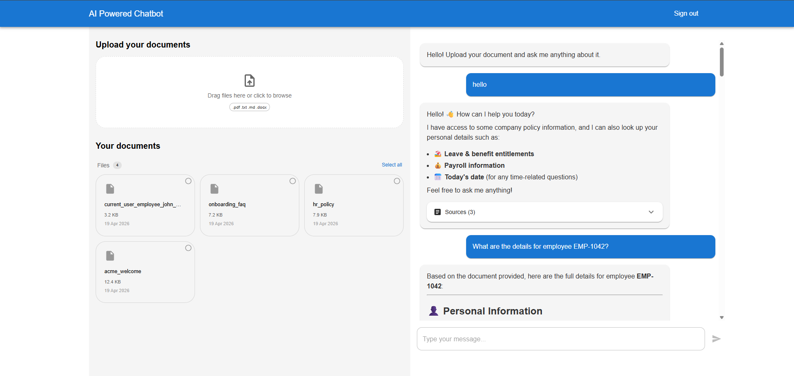
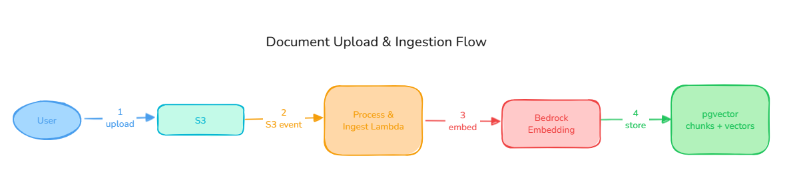
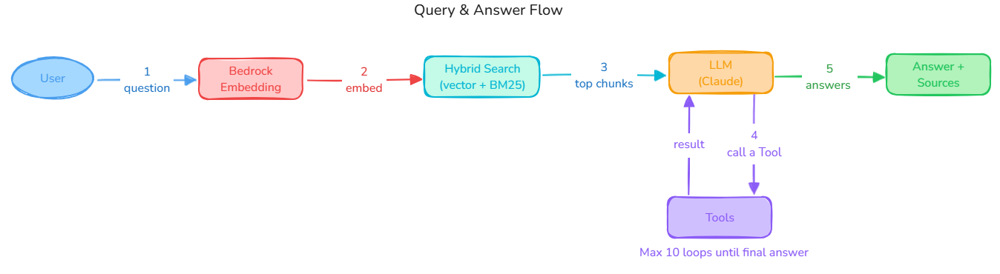

# AI-Powered Document Chat


A serverless application that lets users chat with their uploaded documents using AI.
Built on AWS Bedrock, PostgreSQL + pgvector, and React, using **Agentic RAG** to answer questions grounded in documents — with live tool calls when document context alone isn't enough.

> ⚠️ Demo purposes only.

---

## Table of Contents

1. [What Was Already Built](#what-was-already-built)
2. [What I Built](#what-i-built)
3. [All Features](#all-features)
4. [Architecture & Design Decisions](#architecture--design-decisions)
5. [Ingestion](#ingestion)
6. [Query & Answer](#query--answer)
7. [Assumptions](#assumptions)
8. [What I'd Change With More Time](#what-id-change-with-more-time)
9. [Further Reading](#further-reading)

---

## Application Interface



---

## What Was Already Built

Before this project, the following existed:

- React + TypeScript frontend with AWS Cognito (Google OAuth) authentication
- File upload flow via a pre-built Terraform module: [infra-file-uploader](https://github.com/lrasata/infra-file-uploader)
- Document ingestion Lambda (Python): extracts text, creates fixed-size chunks, stores vectors in PostgreSQL
- Query Lambda (Python): embeds the question, retrieves similar chunks with cosine search, passes them to an LLM

## What I Built

- **Multimodal embeddings:** switched to Amazon Titan Multimodal Embeddings
- **Chunking strategy per format:** PDF, Markdown, DOCX, and plain text each use a different chunking approach suited to their structure
- **Hybrid search:** combined semantic (pgvector cosine) and lexical (BM25 / PostgreSQL FTS) retrieval via Reciprocal Rank Fusion
- **Agentic tool use:** the LLM can call tools mid-conversation to fetch live data (current date, entitlements, payroll) and combine it with document context
- **Conversation memory:** the last 10 messages are sent with every request so the agent can refer back to earlier turns

---

## All Features

- **Document Upload:** `.pdf`, `.txt`, `.md`, `.docx` supported
- **Hybrid Search:** semantic + BM25 merged via Reciprocal Rank Fusion
- **Agentic Tool Use:** LLM calls tools mid-conversation for live data ⚠️ *currently mocked*
- **Conversation Memory:** 5-turn rolling window, client-side
- **Any Bedrock LLM:** switching models is a single Terraform variable change; tested with Claude Sonnet 4.6
- **Secure Authentication:** AWS Cognito with Google OAuth
- **Serverless:** Lambda + API Gateway, auto-scaling, pay-per-use
- **Infrastructure as Code:** full Terraform deployment across four independent layers: secrets, cognito, backend, frontend

---

## Architecture & Design Decisions

### Diagram


### Assumptions

- One embedding model is set at deploy time and never changed mid-deployment (changing it requires full re-ingestion).
- Tool data is mocked. In production these would call real HR or payroll APIs.
- The `min_relevance_score` threshold (default `0.4`) is tuned for the Titan embedding model. Multimodal models produce lower similarity scores and may need a lower threshold.
- BM25 results bypass the `min_relevance_score` filter. An exact keyword match is always sent to the LLM regardless of its semantic score — a low embedding similarity on an exact match means the model didn't find it conceptually close, not that it's irrelevant.
- Conversation history is capped at 10 messages to keep token usage predictable.
- Documents are assumed to be in English; multi-language support requires parameterizing the PostgreSQL FTS dictionary.

### Why Agentic RAG❓

The project has two requirements:
1. Answer questions from static documents
2. Return live, user-specific data on demand (e.g. *"How many vacation days do I have left?"*)

RAG alone covers requirement 1 but not 2 because documents can't answer questions about live data.
Agentic RAG adds tool-calling so the LLM can fetch live data mid-conversation and combine it with document context in a single answer.

Main trade-off: answer quality depends on retrieval quality. Wrong chunks = wrong context = wrong answer, regardless of model quality.

### Where to store vectors❓

A vector store saves text chunks as numerical arrays (embeddings) so they can be searched by meaning at query time. Without it, there is nowhere to index the document chunks after ingestion.

Several options exist:

| Option                       | Cost            | Notes                         |
|------------------------------|-----------------|-------------------------------|
| Pinecone / Weaviate / Qdrant | Pay-per-use     | Data leaves AWS               |
| OpenSearch Serverless        | ~$700/month min | Expensive at low traffic      |
| Amazon S3 Vectors (2025)     | Very cheap      | Immature tooling              |
| **PostgreSQL + pgvector** ✅  | ~$13/month      | Good enough for this use case |

PostgreSQL + pgvector stays inside the VPC, handles both vector and lexical search in one place, and costs almost nothing at demo scale.
The trade-off is it won't scale horizontally — at high volume, migrate to Aurora PostgreSQL or a dedicated vector store.

### Why Hybrid Search❓

Hybrid search runs in the `query-document` Lambda, between embedding the question and sending context to the LLM:

```
User question
    → embed (Titan)
    → hybrid search (semantic + lexical, merged via RRF)
    → top chunks + conversation history + tools
    → LLM (Claude)
    → answer
```

Neither retriever alone is enough:

| Retriever                           | Strength                           | Weakness                                           |
|-------------------------------------|------------------------------------|----------------------------------------------------|
| **Semantic** (pgvector cosine)      | Conceptual questions, paraphrasing | Exact codes, IDs, proper nouns                     |
| **Lexical** (BM25 / PostgreSQL FTS) | Exact keyword matches              | Synonyms — `"holiday"` won't find `"annual leave"` |

Both run in parallel on every query. Results are merged via **Reciprocal Rank Fusion (RRF)**, which re-ranks by position only (no raw score tuning required).

### Bedrock Configuration ⚙️

| Feature                             | Why                                                                                                                                     |
|-------------------------------------|-----------------------------------------------------------------------------------------------------------------------------------------|
| **Converse API**                    | Unified interface across all models. Switching from Claude to Llama or Mistral is a single Terraform variable change                    |
| **Cross-region inference profiles** | Routes requests across regions automatically. Avoids throttling failures, especially outside `us-east-1` where default quotas are lower |
| **Guardrails**                      | Blocks harmful content and prompt injection before the model sees the request. No custom moderation code required                       |

---

## Ingestion

### How it works

1. The user selects a file. The frontend requests a pre-signed S3 URL from the backend and uploads the file directly to S3.
2. S3 triggers the `process-uploaded-file` Lambda, which records the upload in DynamoDB and publishes a message to SNS.
3. SNS triggers the `s3-ingestion` Lambda, which extracts text from the file, splits it into chunks, and converts each chunk into a vector using a Bedrock embedding model.
4. Each chunk and its vector are stored as a row in PostgreSQL (pgvector).



### Supported formats

`.pdf`, `.txt`, `.md`, `.docx`

### Chunking strategy

| Format  | Strategy                    | Chunk size                                                                     | Rationale                                                             |
|---------|-----------------------------|--------------------------------------------------------------------------------|-----------------------------------------------------------------------|
| `.txt`  | Fixed-size with overlap     | ~200 words, 20% overlap                                                        | No structure to exploit; overlap prevents context loss at boundaries  |
| `.md`   | Header-based                | One `#`–`####` section per chunk; fallback to 200 words if section > 800 words | Each heading section is a self-contained unit                         |
| `.pdf`  | Section-aware with fallback | One detected section per chunk; fallback to 300 words / 60-word overlap        | Preserves clause integrity; splitting mid-rule produces wrong answers |
| `.docx` | Fixed-size with overlap     | ~500 words, 50-word overlap                                                    | Fallback for richly formatted documents                               |

### Trade-offs and failure modes

- **PDF silent fallback** — `pdfplumber` loses visual formatting. Section detection will silently fall back for scanned PDFs, multi-column layouts, and image-based headings. Logged to CloudWatch so the fallback rate is measurable.
- **Embedding model lock-in❗** — changing the embedding model invalidates all stored vectors; full re-ingestion required.

---

## Query & Answer

### How it works

1. The user types a question. The frontend sends it with the recent conversation history.
2. The question is embedded using the same model.
3. The backend runs a **hybrid search**: semantic (vector similarity) + lexical (keyword match). Results are merged via RRF.
4. The top chunks, conversation history, and tool definitions are sent to the LLM.
5. The LLM either answers directly or calls a tool. If it calls a tool, the application runs it and sends the result back. This repeats until the LLM produces a final answer.
6. The answer and source chunks are returned to the user.



### The agentic loop

```
User question
      │
      ▼
Embed → hybrid search → filter by min_relevance_score
      │
      ▼
converse(system prompt + document context + history + tool definitions)
      │
      ├── end_turn  →  return answer ✓
      │
      └── tool_use  →  execute tool(s)  →  append results  →  converse again
                        (repeats up to MAX_TOOL_ITERATIONS = 5)
```

The LLM decides autonomously whether to call a tool or answer directly. If the loop hits 5 iterations without `end_turn`, the Lambda returns a 500.

### Available tools

| Tool                  | Returns                                                 | Called when                                        |
|-----------------------|---------------------------------------------------------|----------------------------------------------------|
| `get_current_date`    | `{ "today": "YYYY-MM-DD" }`                             | Questions involving dates, deadlines, or durations |
| `get_my_entitlements` | Vacation days total / used / remaining, training budget | Questions about leave or benefit balances          |
| `get_my_payroll_info` | Salary band, current salary, next review date           | Questions about compensation                       |

> **Note:** All tools are currently mocked. Swapping in real data sources only requires changing the function body — the loop, dispatcher, and tool definitions are unchanged.

### Conversation memory

The frontend holds all messages in React state and sends the last 10 (5 turns) with every request. The Lambda prepends these to the Bedrock Converse `messages` array.

This keeps the Lambda fully stateless (no session table, no cold-start lookup). History resets on page refresh, which is acceptable for short-lived document chat sessions.

---

## What I'd Change With More Time

**Retrieval quality**
- Measure retrieval Hit Rate independently (not just end-to-end answer quality) to verify the right chunks are being retrieved
- Reduce chunk size and increase overlap for short introductory sections, which currently under-retrieve
- Add human review to the evaluation pipeline — LLM-as-judge alone is not sufficient

**Robustness**
- Replace mocked tools with real API integrations
- Add per-document language detection to parameterise the FTS dictionary
- Add a reranker (e.g. Cohere Rerank) between retrieval and generation for ambiguous queries

**Scale**
- Replace synchronous Lambda ingestion with a queue-driven approach (SQS + Step Functions) for large documents and concurrent uploads

---

## Further Reading

- [DESIGN.md](DESIGN_DETAILS.md) — hybrid search, RRF implementation, chunking rationale, Bedrock configuration, monitoring, and scalability limits
- [DEPLOYMENT.md](DEPLOYMENT.md) — infrastructure setup and Terraform configuration