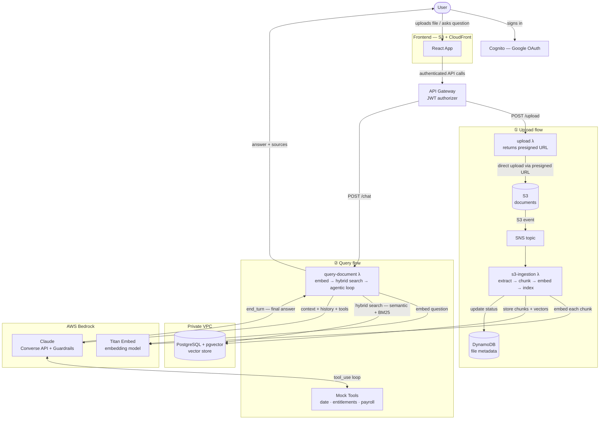

# AI-Powered Document Chat

A cloud-native application that lets users chat with their uploaded documents using AI. Built with AWS Bedrock, PostgreSQL + pgvector, and React. 
Uses **Agentic Retrieval-Augmented Generation (RAG)** to answer questions grounded in the user's own documents, with the ability to call live tools mid-conversation when document context alone is not enough.

---

## Table of Contents

1. [How It Works](#how-it-works)
2. [Architecture & Design Decisions](#architecture--design-decisions)
3. [Document Handling](#document-handling)
4. [Agentic Tool Use — When & How](#agentic-tool-use--when--how)
5. [Assumptions](#assumptions)
6. [What I'd Change With More Time](#what-id-change-with-more-time)
7. [Further Reading](#further-reading)

## Features

- **Document Upload** — `.pdf`, `.txt`, `.md`, `.docx` supported; multimodal embedding models (e.g. Amazon Titan Multimodal Embeddings) enabled
- **Hybrid Search** — semantic (pgvector cosine) + lexical (BM25 / PostgreSQL FTS) retrieval merged via Reciprocal Rank Fusion for better coverage across conceptual and exact-term queries
- **Agentic Tool Use** — LLM calls tools mid-conversation to fetch live data (current date, entitlements, payroll) and combines it with document context in a single answer
- **Conversation Memory** — last 10 messages (5 turns) sent with every request so the agent can refer back to earlier exchanges within the same session
- **Any Bedrock LLM** — switching models is a Terraform variable change, no code change required; tested with Anthropic Claude 4.6 Sonnet
- **Secure Authentication** — AWS Cognito with Google OAuth
- **Serverless Architecture** — Lambda + API Gateway; auto-scaling, pay-per-use
- **Infrastructure as Code** — full Terraform deployment across four independent layers

## How It Works

There are two flows: uploading a document, and asking a question.



### Uploading a document

1. The user selects a file in the UI. The frontend requests a pre-signed S3 URL from the backend and uploads the file directly to S3.
2. S3 triggers a Lambda function (`s3-ingestion`) via SNS.
3. The Lambda extracts the text from the file, splits it into smaller pieces called **chunks**, and converts each chunk into a **vector** — a list of numbers that captures the meaning of that text — by calling an AWS Bedrock embedding model.
4. Each chunk and its vector are stored as a row in a PostgreSQL database (using the `pgvector` extension).

At the end of this flow, the document is indexed and ready to be searched.

### Asking a question

1. The user types a question. The frontend sends it to the backend along with the recent conversation history.
2. The question is converted into a vector using the same embedding model.
3. The backend runs a **hybrid search**: it searches the database for chunks that are semantically similar to the question (vector search) and for chunks that contain the exact keywords from the question (full-text search). Both result lists are merged into a single ranked list.
4. The top chunks are assembled into a context block and sent to an LLM (Claude via AWS Bedrock), along with the conversation history and a set of **tool definitions**.
5. The LLM decides what to do:
   - If the answer is in the context → it answers directly.
   - If live data is needed (e.g. vacation balance, current date) → it calls a tool. The application executes the tool and sends the result back to the LLM. This loop repeats until the LLM has everything it needs.
6. The final answer is returned to the user, along with the source chunks it was based on.

---

## Architecture & Design Decisions

The sections below explain the key choices made at each step of the flows described above.

### Why Agentic RAG?

The assignment has two requirements:

1. Answer questions based on static documents (PDF, TXT, Markdown)
2. Return dynamic information on demand — e.g. *"How many vacation days do I have left?"*

RAG alone covers requirement 1. It retrieves relevant document passages and passes them to the LLM as context. 
But it cannot cover requirement 2 — documents are static and cannot answer questions about live, user-specific data.

The suggested solution is **Agentic RAG**: the LLM does not just read the retrieved context, it can also call tools 
to fetch live data mid-conversation. After retrieval, the LLM receives both the document context and a set of tool definitions. 
It decides autonomously whether to answer directly, call a tool, or chain multiple tools together. The application executes the requested tools and feeds the results back until the LLM produces a final answer.

This way both requirements are handled in a single, unified flow — the user asks one question and gets one answer, whether it comes from a document, a live data source, or both combined.

The main trade-off: answer quality on requirement 1 depends on retrieval quality. If the wrong chunks are retrieved, the LLM gets the wrong context and produces a wrong answer, regardless of how good the model is.

### Why Hybrid Search (Semantic + BM25)?

Neither retrieval method alone is sufficient for a document chat assistant:

| Retriever                           | Strength                                                                  | Weakness                                                            |
|-------------------------------------|---------------------------------------------------------------------------|---------------------------------------------------------------------|
| **Semantic** (pgvector cosine)      | Conceptual questions — finds relevant chunks even when exact words differ | Exact terms, codes, IDs (e.g. `EMP-1042`, `Clause 4.2.1`)           |
| **Lexical** (BM25 / PostgreSQL FTS) | Exact keyword matches                                                     | Synonyms and paraphrasing — `"holiday"` won't find `"annual leave"` |

The two retrievers run in parallel and their ranked results are merged using **Reciprocal Rank Fusion (RRF)**. 
RRF discards raw scores entirely and uses rank position only — a chunk appearing in both lists scores higher than one appearing in just one. 
This requires no per-domain tuning and is robust across document types.

### Where to store vectors?

Every document chunk is converted into a vector (a list of numbers representing its meaning). Those vectors need to be stored somewhere so they can be searched at query time. Several options exist:

| Option                           | Cost                | Stays in AWS | Maturity | Limitation                                              |
|----------------------------------|---------------------|--------------|----------|---------------------------------------------------------|
| **Pinecone / Weaviate / Qdrant** | Pay-per-use         | No           | High     | Data leaves AWS; external dependency                    |
| **OpenSearch Serverless**        | ~$700/month minimum | Yes          | High     | Always-on compute units required even at zero traffic   |
| **Amazon S3 Vectors** (2025)     | Very cheap          | Yes          | Low      | Brand new; limited query capabilities; immature tooling |
| **PostgreSQL + pgvector** ✅      | ~$13/month          | Yes          | High     | Not built for vector search at very large scale         |

**Why PostgreSQL + pgvector is the right choice for this demo**

`pgvector` is a PostgreSQL extension that adds a vector column type and a cosine similarity search operator directly in the database. 

For a demo with a small document collection and low query volume, PostgreSQL handles vector search without any issues. 
The `db.t4g.micro` instance at ~$13/month is affordable, and the setup requires no extra infrastructure. 
At production scale — millions of chunks, hundreds of concurrent users — a dedicated vector store would be a better fit. But for this use case, PostgreSQL is more than sufficient.

### LLM — Bedrock Converse API

AWS Bedrock offers two ways to call a model: invoke it directly (model-specific request format) or use the **Converse API** (unified format across all models).

This project uses Converse. The benefit is that the request shape — messages, system prompt, tool definitions — is identical regardless of which model is behind it. 
Switching from Claude to Llama 3 or Mistral is a single Terraform variable change; no application code changes. 
This also makes the tool use loop model-agnostic: any Converse-compatible model can call tools using the same protocol.

### Why cross-region inference profiles?

When you call a Bedrock model directly, the request goes to one region. If that region is throttled or hits a quota limit, the call fails.

A **cross-region inference profile** is a Bedrock construct that routes requests across multiple AWS regions automatically. 
If one region is busy, Bedrock tries another. This improves availability and makes quota limits less likely to affect users — especially important outside `us-east-1` where default quotas are lower.

The Lambda calls the inference profile ARN instead of a model ID directly. AWS fully manages the routing.

### Why Bedrock Guardrails?

Without content filtering, users could send harmful prompts and the LLM would process them. Writing custom moderation logic is complex and easy to get wrong.

**Bedrock Guardrails** sits between the application and the model. Every request to `query-document` passes through a guardrail that blocks violent, sexual, hateful, and insulting content, as well as prompt injection attacks — before the model ever sees the input or produces a response. This is enforced at the API layer with no custom code required.

---

## Document Handling

### Supported formats

`.pdf`, `.txt`, `.md`, `.docx`

### Chunking strategy

The ingestion Lambda applies a different chunking strategy per format, because the optimal unit of retrieval depends on document structure:

| Format  | Strategy                    | Chunk size                                                                                                                                        | Rationale                                                                      |
|---------|-----------------------------|---------------------------------------------------------------------------------------------------------------------------------------------------|--------------------------------------------------------------------------------|
| `.txt`  | Fixed-size with overlap     | ~200 words, 20% overlap                                                                                                                           | No exploitable structure; overlap prevents losing context at boundaries        |
| `.md`   | Header-based hierarchical   | One `#`–`####` section per chunk; fallback to fixed-size (200 words) if section > 800 words                                                       | Each heading section is an atomic unit — splitting mid-section loses coherence |
| `.pdf`  | Section-aware with fallback | Regex detects headings; one section per chunk; fallback to fixed-size (300 words, 60-word overlap) if no headings detected or section > 600 words | Preserves policy clause integrity; splitting mid-rule produces wrong answers   |
| `.docx` | Fixed-size with overlap     | ~500 words, 50-word overlap                                                                                                                       | Default fallback for richly formatted documents                                |

### Key trade-offs and failure modes

- **PDF silent fallback** — `pdfplumber` extracts text but loses all visual formatting (bold, font size, indentation). 
The section-detection regex will silently fall back to fixed-size chunking for scanned PDFs, multi-column layouts, and image-based headings. 
Ingestion succeeds but retrieval quality degrades. This is logged to CloudWatch (`PDF: no sections detected, falling back to fixed-size chunking`) so the fallback rate is measurable.

- **Embedding model lock-in** — every chunk is stored as a vector produced by the configured Bedrock embedding model. Changing the model invalidates all stored vectors; a full re-ingestion is required. The model is set once via a Terraform variable and must remain consistent for the lifetime of the vector store.

- **English-only lexical search** — `to_tsvector('english', ...)` uses English stemming and stop words. Documents in other languages will get degraded BM25 retrieval.


## Agentic Tool Use — When & How

### The agentic loop

```
User question
      │
      ▼
Embed question → hybrid search (semantic + BM25) → filter by min_relevance_score
      │
      ▼
converse(system prompt + document context + conversation history + tool definitions)
      │
      ├── stopReason = "end_turn"
      │         └─→ return answer ✓
      │
      └── stopReason = "tool_use"
                │
                ▼
          execute requested tool(s)
                │
                ▼
          append tool results to conversation
                │
                └─→ converse(updated messages) ── repeat up to MAX_TOOL_ITERATIONS (5)
```

The LLM decides autonomously whether to call a tool or answer directly — no routing logic exists on the application side. `toolChoice: auto` is set on every `converse` call.

A hard limit of `MAX_TOOL_ITERATIONS = 5` prevents infinite loops. If exhausted without reaching `end_turn`, the Lambda returns a 500.

### Available tools

| Tool                  | Returns                                                           | When the LLM calls it                                                      |
|-----------------------|-------------------------------------------------------------------|----------------------------------------------------------------------------|
| `get_current_date`    | `{ "today": "YYYY-MM-DD" }`                                       | Any question involving durations, deadlines, or time-relative calculations |
| `get_my_entitlements` | Vacation days total / used / remaining, training budget remaining | Questions about leave balance or benefit entitlements                      |
| `get_my_payroll_info` | Salary band, current salary, next review date                     | Questions about compensation or upcoming review                            |

> **Note:** Tool implementations are currently mocked with fixed data. They demonstrate the agentic pattern — swapping in real data sources only requires changing the function body. The loop, dispatcher, and tool definitions remain unchanged.

### Conversation memory

The agent maintains memory across turns within a session using **client-side history**. The frontend holds all messages in React state and sends a rolling window of the last 10 messages (5 turns) with every request. The Lambda prepends these turns to the Bedrock Converse `messages` array before sending the current question.

This keeps the Lambda fully stateless — no DynamoDB session table, no cold-start lookup — at the cost of history resetting on page refresh, which is acceptable for a document chat use case where sessions are naturally short-lived.

---

## Assumptions

- One embedding model is configured at deploy time and never changed mid-deployment (changing it requires full re-ingestion).
- Tool data (entitlements, payroll) is currently mocked. In a real system these would call internal HR or payroll APIs.
- The `min_relevance_score` threshold (default `0.4`) is tuned for the default Titan embedding model. Multimodal models produce lower text similarity scores and may need a lower threshold.
- BM25 results are not pre-filtered by relevance score — a chunk matching exact keywords is always worth surfacing regardless of its vector score.
- Conversation history is bounded to 10 messages to keep token usage and Bedrock costs predictable.
- The system is designed for documents in English; multi-language support would require parameterising the PostgreSQL FTS dictionary.

---

## What I'd Change With More Time

**Retrieval quality**
- Measure retrieval Hit Rate in isolation (not just end-to-end answer quality) to verify the right chunks are being retrieved before generation
- Reduce chunk size and increase overlap for short introductory sections, which currently under-retrieve
- Add human review to the evaluation pipeline — the current LLM-as-judge approach is fully automated and insufficient on its own

**Robustness**
- Replace mocked tools with real API integrations
- Add per-document language detection to parameterise the FTS dictionary
- Add a reranker (e.g. Cohere Rerank) between retrieval and generation to improve precision on ambiguous queries

**Scale**
- Replace the synchronous Lambda ingestion pipeline with a queue-driven approach (SQS + workers or Step Functions) for large documents and concurrent uploads, both of which can exhaust the current Lambda timeout and Bedrock TPM quota

**Security**
- Enable MFA for Cognito users
- Enable CloudTrail for full API audit logging

---

## Further Reading

- [DESIGN.md](DESIGN.md) — deep-dive on hybrid search, RRF implementation, chunking rationale, Bedrock configuration, monitoring, and scalability limits
- [DEPLOYMENT.md](DEPLOYMENT.md) — infrastructure setup and Terraform configuration guide